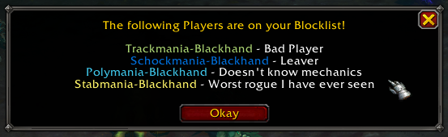

# Blocklist
Blocklist is an addon which lets you add players to your personal blocklist and notifies you when you are in the same group with a blocked player.

## Usage
Type `/blocklist` in chat to open the configuration window.  

In the first tab you can see a list of the currently blocked players. At the right side of each entry you can click the `-`-Button to unblock a player.  

In the second tab you can see a list of players that were in a group with you recently. This list isn't saved between logouts/reloads. At the right side of each entry you can click the `+`-Button to add the player to the blocked list. A confirmation popup will show and asks you for a note (reason).  

Currently the only way to add players to the list is through the `Recent Players`-list.

## Screenshots
